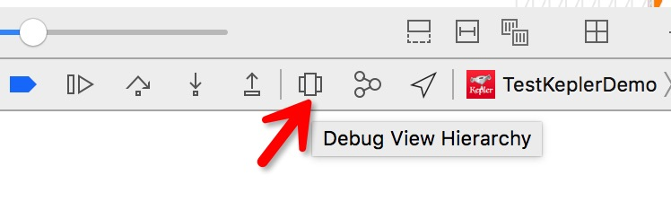
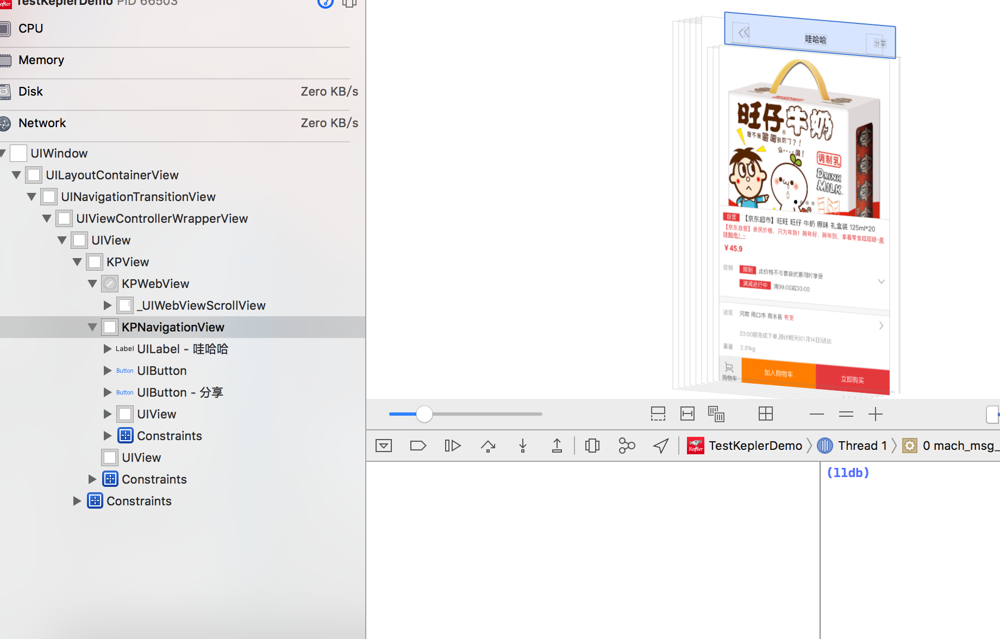
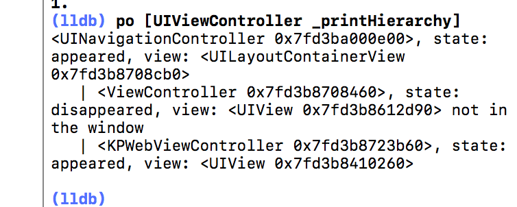
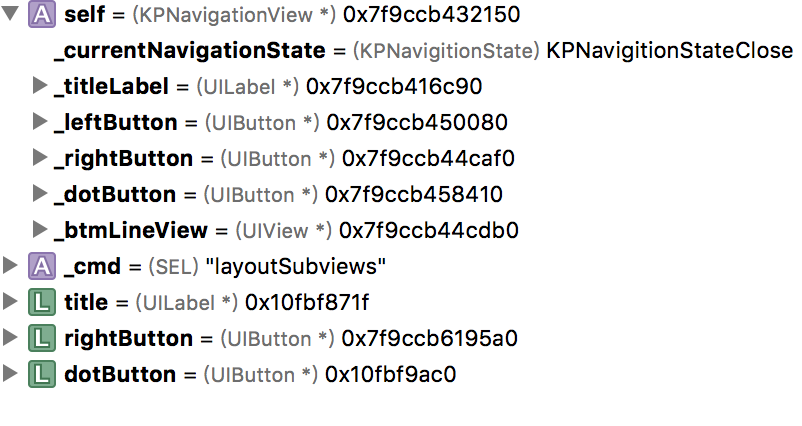

#调试修改第三方sdk内容

###背景：
经常在使用第三方sdk的时候发现有页面长的不好看，或者说有什么特别需要修改的地方，于是乎就有这么一篇文章了。

最近在搞京东开普勒项目，就那他们的sdk做例子吧。

###  1.首先看一下京东的商品详情页   
       
 	 
 <font color='#43BFC7'>这时候如果需要修改title怎么办呢。</font>   

### 2.用ui断点调试看看，先运行，然后点击如图所示位置`Debug View Hierarchy`   
  
 
### 3.然后在视图上点击一下上面的导航条，左边就会出现这个view树，然后可以找到原来这个view是 `KPNavigationView` 类。其实还可以看到其他很多。
   
### 4.顺便用 lldb 调试查看一下现有的 VC。命令 `po [UIViewController _printHierarchy]`,可以看到这个页面所在的VC是 `KPWebViewController `   
  
   
### 5.找到了自定义导航条的类，这时候就可以用 Method Swizzling 的方法去替换其中的方法达到效果了，下面贴具体代码。   
```
///新建一个类KPNavigationView的category，其中要先声明一下这个类，因为这个类没有在头文件中存在。
@interface KPNavigationView : UIView
@end
@interface KPNavigationView (hook)
@end
```
   
具体实现方法先进行方法替换，将UIView中会调用的`layoutSubviews `方法修改成自己的方法。   

```
@implementation KPNavigationView (hook)

+ (void)load
{

    Method ori_Method =  class_getInstanceMethod([KPNavigationView class], @selector(layoutSubviews));
    Method my_Method = class_getInstanceMethod([KPNavigationView class], @selector(ash_layoutSubviews));

    method_exchangeImplementations(ori_Method, my_Method);

}


- (void)ash_layoutSubviews
{
    [self ash_layoutSubviews];
    UILabel* title = [self valueForKey:@"_titleLabel"];
    title.text = @"哇哈哈";
    
    UIButton* rightButton = [self valueForKey:@"_rightButton"];
    [rightButton setTitle:@"分享" forState:UIControlStateNormal];

    
    UIButton* dotButton = [self valueForKey:@"_dotButton"];
    dotButton.hidden = YES;

}
@end
```
在这里小伙伴肯定有疑问，我是怎么找到这个 titlelabel的呢。   
我们替换完方法之后 可以在 `[self ash_layoutSubviews];`这里断点会发现   

    
于是就找到了对应的控件啦，最后运行看看效果.   
    
这样就完成啦。！

### 6.那如果想不要用他的导航条，用自己app统一的导航条怎么办呢，这时候就应该在VC里面修改了，估计京东是隐藏了系统的导航条。我们在前面找到了京东的这个VC叫`KPWebViewController`，我们就采用同样的方法。   
```
@implementation KPWebViewController (hook)

+ (void)load
{
    Method ori_Method =  class_getInstanceMethod([KPWebViewController class], @selector(viewWillAppear:));
    Method my_Method = class_getInstanceMethod([KPWebViewController class], @selector(ash_viewWillAppear:));
    
    method_exchangeImplementations(ori_Method, my_Method);
}

- (void)ash_viewWillAppear:(BOOL)animal
{
    [self ash_viewWillAppear:animal];
    
    UIView* navigationview = [[self valueForKey:@"_kpView"] valueForKey:@"_navigationView"];
    navigationview.hidden = YES;
    UINavigationController* nav = self.navigationController;
    nav.navigationBar.hidden = NO;
    [nav setNavigationBarHidden:NO];
}
@end
```   
OK  大功告成。

代码： [京东sdk-hook](https://github.com/wu736139669/jingdongkaipule)


   
   